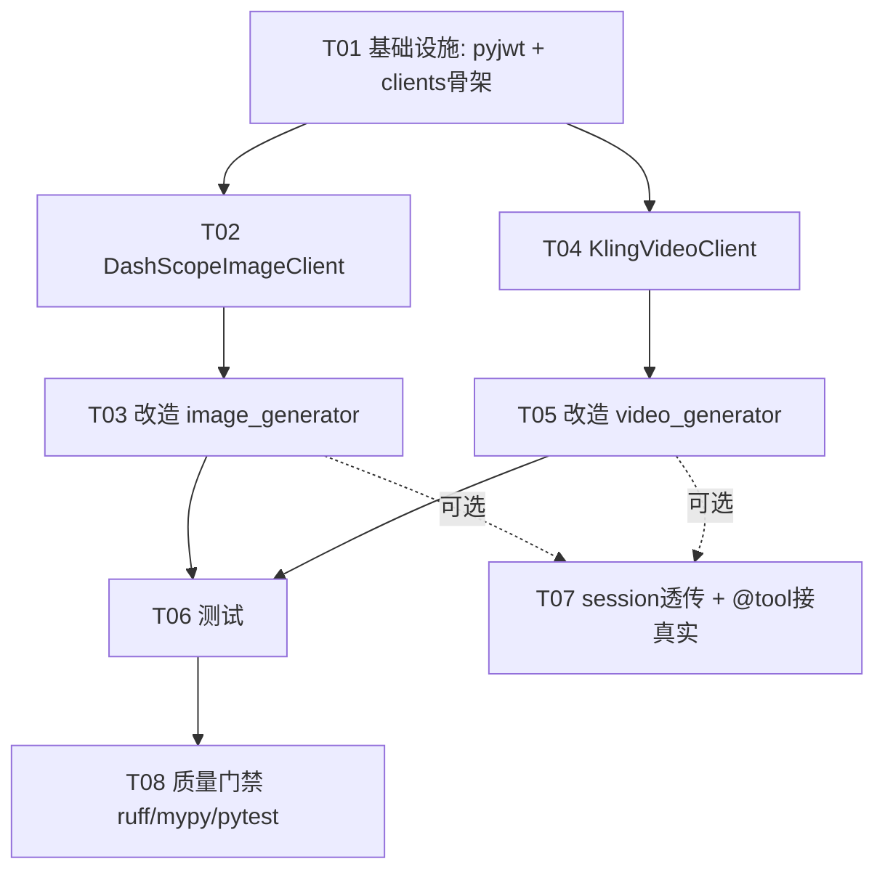

# 增量架构设计：Mock 图片 / 视频生成器 → 真实实现

> 项目：`/Volumes/macmini_disk/claudecode/agent_part`（已存在的 LangGraph + FastAPI 多 Agent 商品视觉生成系统）
> 设计人：架构师 高见远
> 目标：把 `image_generator.py` / `video_generator.py` 内部的 **Mock 占位生成** 改为调用 **DashScope 通义万象 `wanx-v1`（图片）** 与 **Kling AI `kling-v1`（视频）** 真实 API，保持优雅降级，并修正 `model`/`provider`/`is_mock` 字段。
> 本文只描述**变更部分**，不重写既有架构。

---

## 0. 决策摘要（TL;DR）

| # | 议题 | 决策 |
|---|------|------|
| 1 | 客户端放哪 | 新增 `src/clients/` 包，图片/视频各一个 client 类做关注点分离，便于单测 |
| 2 | 图片真实调用 | `DashScopeImageClient` 封装 `dashscope.ImageSynthesis.call`（`asyncio.to_thread`）+ httpx 下载字节 |
| 3 | 视频真实调用 | `KlingVideoClient`：HS256 JWT 鉴权 → 提交异步任务 → 轮询状态 → 取结果 URL → 下载字节 |
| 4 | 优雅降级 | client `is_available()` 判定 key 是否存在；缺失则 Agent 走原 Mock 占位 + `logger.warning` |
| 5 | **session 透传** | **本轮不打通 task_manager→workflow→agent 的 DB session**（运行时当前根本没建 session）。仅：①保留并利用 Agent 既有的 `session` 形参；②修正 `_create_asset_po` 的 `provider`/`is_mock` 形参，使"一旦注入 session 即正确落库"。DB 落库列为**可选增强任务** |
| 6 | `model`/`provider`/`is_mock` | `GeneratedImage.model` / `GeneratedVideo.model` 改用 `settings.image_model` / `settings.video_model`；真实时 `metadata.provider=真实模型名, is_mock=False`，降级时 `provider="mock", is_mock=True` |
| 7 | 存储策略 | 真实结果**下载为字节后写入既有 StorageBackend**（与 Mock 一致：`/static/...`），不再直接存远端临时 URL，避免外链过期 |
| 8 | LangChain `@tool` | `generate_product_image` / `generate_product_video` / `generate_storyboard` 走另一条路径，本轮**标记可选/低优先**，不在核心交付内 |
| 9 | 新增依赖 | 仅 `pyjwt>=2.8.0`（JWT 鉴权）；`httpx` 已在 |

---

## 1. 实现方案（Implementation Approach）

### 1.1 技术难点

1. **DashScope SDK 是同步阻塞 API**：`dashscope.ImageSynthesis.call` 阻塞事件循环；Agent 是 async，需用 `asyncio.to_thread` 包裹，且 SDK 返回类型为 `Any`（mypy `warn_return_any=true`，需 `cast`/`TypedDict` 收敛）。
2. **Kling 是异步任务模型**：需 JWT Bearer 鉴权（HS256）+ 提交→轮询→结果下载三段式，要处理轮询超时、退避、失败态。
3. **优雅降级不破坏现有 CI/本地**：无 key 时行为须与现状完全一致（仍生成 `/static/` 占位资源、`is_mock=True`、`provider="mock"`），并打 warning。
4. **质量门禁**：ruff(strict) + mypy(strict) + pytest(`fail_under=80`)，新增 client 模块必须有单测覆盖。

### 1.2 新增 `src/clients/` 做关注点分离

把"外部 API 调用 + 结果下载"从 Agent 中抽离到独立 client 类：
- Agent 只负责：降级判定、字节落存储、构造领域对象（`GeneratedImage`/`GeneratedVideo`）、可选 DB 落库。
- Client 只负责：与远端 API 通信、把结果收敛为 `bytes`（+ 远端 url/seed/task_id）。
- 好处：可用 `unittest.mock` / `pytest-httpx` 完全离线单测 client；Agent 单测可注入 Fake client，无需网络。

包结构（见第 2 节文件列表）：
- `src/clients/__init__.py`：导出两个 client + 工厂 `get_image_client()` / `get_video_client()`（读 `settings`，无 key 则返回 `None` 表示降级）。
- `src/clients/provider_result.py`：共享结果数据类 + 降级判定辅助 + 自定义异常。
- `src/clients/dashscope_image_client.py`
- `src/clients/kling_video_client.py`

### 1.3 图片真实调用流程（DashScope `wanx-v1`）

```text
Agent._call_image_api
  └─ client.is_available()? ── False ──► Mock 占位（原逻辑）
        │ True
        ▼
  client.generate(prompt, negative_prompt, width, height, n, seed?)
        │
        ├─ asyncio.to_thread(dashscope.ImageSynthesis.call,
        │       model=settings.image_model, prompt=..., negative_prompt=...,
        │       n=..., size=f"{width}*{height}", api_key=...)
        │     ► 返回 result，取 result.output.results[].url
        ├─ httpx.AsyncClient.get(url) ──► bytes   （下载为字节再落库）
        └─ 返回 ImageGenerationResult(images=[SingleImageResult(data=bytes, url=remote_url, seed=...)])
  Agent: 写 StorageBackend → 构造 GeneratedImage(model=settings.image_model, is_mock=False, provider=wanx-v1)
```

要点：
- `size` 用 `"{width}*{height}"` 格式（如 `1024*1024`）。
- `n` 取 1（与现状 `_call_image_api` 一次出一张一致；批量的多张由 Agent 外层 `for prompt_data` 循环驱动）。
- 返回的是**字节**，Agent 复用既有 `_write_asset_to_storage`/`_create_asset_po`，改动最小。

### 1.4 视频真实调用流程（Kling `kling-v1`）

```text
Agent._call_video_api
  └─ client.is_available()? ── False ──► Mock 占位（原逻辑）
        │ True
        ▼
  client.generate(prompt, image=None, duration, mode="std", ...)
        │
        ├─ _create_token():  pyjwt.encode({iss=access_key, exp=now+1800, nbf=now-5},
        │                     secret_key, algorithm="HS256")   # 实例内缓存至 exp-60s
        ├─ _submit():  POST {base_url}/v1/videos/generations
        │              headers: Authorization: Bearer <jwt>, Content-Type: application/json
        │              body: {model:"kling-v1", prompt, mode, duration, image?...}
        │            ► 返回 data.task_id
        ├─ _query(task_id): GET {base_url}/v1/videos/generations/{task_id}
        │            ► task_status: submitted/processing/succeed/failed
        │               succeed → data.works[0].resource_url
        ├─ 轮询：间隔 5s（指数退避上限 30s），总超时默认 300s；
        │        failed → 抛 ProviderUnavailableError
        ├─ _download(resource_url) ──► bytes
        └─ 返回 VideoGenerationResult(data=bytes, url=resource_url, duration, task_id)
  Agent: 写 StorageBackend → 构造 GeneratedVideo(model=settings.video_model, is_mock=False, provider=kling-v1)
```

要点：
- 端点：`https://api.klingai.com`（国内 `https://platform.klingai.com`）。**硬编码为模块常量 `KLING_API_BASE`**，构造参数 `base_url` 可覆盖（便于测试/未来切换），**不新增 settings 字段**（满足"无需新增配置项"）。
- JWT 缓存：实例属性 `_token_cache: tuple[str, float] | None`（token, 过期时间戳）；取用时若 `now < exp-60` 复用，否则重建。Agent 在工作流内为单例，实例缓存足够；多实例并发各自签发，开销可忽略。
- 轮询退避与超时做成可配置参数，便于测试加速。

### 1.5 优雅降级策略（共享约定，见第 8 节）

- 判定函数集中在 `provider_result.py`：
  - `is_image_provider_configured(s) -> bool`：`bool(s.dashscope_api_key)`
  - `is_video_provider_configured(s) -> bool`：`bool(s.kling_access_key and s.kling_secret_key)`
- `client.is_available()` 内部调用上述函数。
- Agent 侧：`if client and client.is_available():` 走真实；否则走 Mock 占位并 `logger.warning("... 缺失，回退 mock 占位行为")`。
- **重要**：降级时生成的资源与现状逐字节一致（`/static/`、占位字节、`is_mock=True`、`provider="mock"`），确保无 key 的 CI/本地不被破坏。

### 1.6 session 透传决策（明确回答主理人问题）

**结论：本轮只保证"本地存储 + 返回真实对象"，DB 落库保持"已知限制"，并把 agent 层已有的 `session` 形参利用起来 + 修正 `_create_asset_po` 形参。**

依据（已读源码核实）：
- `src/api/service/task_manager.py:144` 运行时 `workflow = ProductVisualWorkflow()` **完全没传 session**。
- `src/graph/workflow.py` 的 `add_agent_nodes()` 创建 `ImageGeneratorAgent()` / `VideoGeneratorAgent()` 时也**未注入 session**（Agent `__init__` 的 `session_factory` 形参在运行时始终为 `None`）。
- 节点函数 `image_generator_node` 调 `image_generator.execute(state)` 也不传 session。
- 因此 `_call_image_api(state=..., session=None)` 的 `session` 始终为 `None`，`_create_asset_po` 在工作流路径中是**死代码**（资产只落本地文件，不写资产表）。这与主理人描述一致。

本轮回应方式：
1. **不**改动 `task_manager.py` / `workflow.py` 去新建并管理 async DB session 生命周期（事务边界、并发、回滚超出本次"接真实 API"核心范围，且会放大一次性 PR 风险）。
2. 保留 `Agent._call_image_api(_, session=None)` / `_call_video_api(_, session=None)` 形参；当被注入 session 时（如现有单测 `test_mock_providers.py` 直接传 `mock_session`），即正确落库。
3. 修正 `_create_asset_po`，把写死的 `provider="mock", is_mock=True` 改为形参 `provider: str, is_mock: bool`，真实路径传 `provider=settings.image_model, is_mock=False`。
4. 提供**可选任务 T07**：若要把运行时 DB 落库打通，步骤为 `task_manager` 打开 `AsyncSession` → `ProductVisualWorkflow(session=...)` → `WorkflowBuilder(session=...)` → `add_agent_nodes` 给 Agent 传 `session=self._session` → Agent `execute`/`_generate_*` 把 `session` 透传到 `_call_*_api`。该任务独立评审、不阻塞核心交付。

### 1.7 `model` / `provider` / `is_mock` 字段修正

| 位置 | 现状 | 改为 |
|------|------|------|
| `GeneratedImage.model` | 硬编码 `"wanx-v1"` | `self.settings.image_model` |
| `GeneratedVideo.model` | 硬编码 `"kling-v1"` | `self.settings.video_model` |
| `metadata.provider` | `"mock"` | 真实：`settings.image_model` / `settings.video_model`；降级：`"mock"` |
| `metadata.is_mock` | `True` | 真实：`False`；降级：`True` |
| `_create_asset_po` 落库 `provider` | `"mock"`（写死） | 真实：`settings.image_model` / `settings.video_model`；降级：`"mock"` |
| `_create_asset_po` 落库 `is_mock` | `True`（写死） | 真实：`False`；降级：`True` |

---

## 2. 文件列表（新增 / 修改，相对路径）

### 新增
| 路径 | 作用 |
|------|------|
| `src/clients/__init__.py` | 导出 `DashScopeImageClient`、`KlingVideoClient`、`get_image_client()`、`get_video_client()` |
| `src/clients/provider_result.py` | `ImageGenerationResult` / `SingleImageResult` / `VideoGenerationResult` 数据类；`is_image_provider_configured` / `is_video_provider_configured`；异常 `ProviderUnavailableError` |
| `src/clients/dashscope_image_client.py` | 图片真实客户端 |
| `src/clients/kling_video_client.py` | 视频真实客户端（JWT + 异步轮询） |
| `tests/test_agents/test_clients.py` | client 单测（mock `dashscope` + `pytest-httpx` mock Kling 三段式） |

### 修改
| 路径 | 改动点 |
|------|--------|
| `src/agents/image_generator.py` | `__init__` 新增 `_image_client`；`_call_image_api` 接入 client + 降级分支；`model` 改用 `settings.image_model`；`_create_asset_po` 增加 `provider`/`is_mock` 形参 |
| `src/agents/video_generator.py` | 同上（视频）；`model` 改用 `settings.video_model` |
| `pyproject.toml` | `dependencies` 增加 `pyjwt>=2.8.0` |
| `tests/test_agents/test_mock_providers.py` | 扩展：覆盖"真实路径（注入 Fake client）"与"降级 warning"；断言 `_create_asset_po` 落库 `provider=真实模型, is_mock=False` |

> 说明：`workflow.py` / `task_manager.py` 仅在**可选任务 T07** 中改动。

---

## 3. 接口 / 数据结构

### 3.1 新增 client 类公开方法签名（输入 / 输出）

```python
# src/clients/provider_result.py
@dataclass
class SingleImageResult:
    data: bytes          # 下载后的图片字节（落 StorageBackend 用）
    url: str             # 远端临时 URL（可记入 metadata）
    seed: int | None

@dataclass
class ImageGenerationResult:
    images: list[SingleImageResult]

@dataclass
class VideoGenerationResult:
    data: bytes          # 下载后的视频字节
    url: str             # 远端结果 URL
    duration: float      # 实际时长
    task_id: str         # Kling 任务 ID（可记入 metadata）

class ProviderUnavailableError(Exception): ...
```

```python
# src/clients/dashscope_image_client.py
class DashScopeImageClient:
    def __init__(self, settings: Settings | None = None,
                 httpx_client: AsyncClient | None = None) -> None: ...
    def is_available(self) -> bool: ...
    async def generate(
        self,
        prompt: str,
        negative_prompt: str | None = None,
        width: int = 1024,
        height: int = 1024,
        n: int = 1,
        seed: int | None = None,
    ) -> ImageGenerationResult: ...
    # 内部: _call_api(...) -> dict ; _download(url: str) -> bytes
```

```python
# src/clients/kling_video_client.py
class KlingVideoClient:
    def __init__(self, settings: Settings | None = None,
                 base_url: str = KLING_API_BASE,
                 httpx_client: AsyncClient | None = None,
                 poll_interval: float = 5.0,
                 poll_timeout: float = 300.0) -> None: ...
    def is_available(self) -> bool: ...
    async def generate(
        self,
        prompt: str,
        image: bytes | None = None,
        duration: float = 5.0,
        mode: str = "std",
        cfg_scale: float = 0.5,
        aspect_ratio: str = "16:9",
    ) -> VideoGenerationResult: ...
    # 内部: _create_token() -> str ; _submit(...) -> str ;
    #       _query(task_id) -> tuple[str, str | None] ; _download(url) -> bytes
```

### 3.2 与 Agent 方法的交互边界

| Agent 方法 | 调用 client | 接收 | 后续处理 |
|-----------|------------|------|----------|
| `ImageGeneratorAgent._call_image_api` | `client.generate(prompt, negative_prompt, width, height, n, seed)` | `ImageGenerationResult` | 取 `images[0].data` 写存储；构造 `GeneratedImage`；可选 `_create_asset_po` |
| `VideoGeneratorAgent._call_video_api` | `client.generate(prompt, duration, mode, ...)` | `VideoGenerationResult` | 取 `.data` 写存储；构造 `GeneratedVideo`；可选 `_create_asset_po` |

边界原则：**client 只产字节 + 元数据，不碰存储 / DB / 领域对象**；降级决策在 Agent 内（基于 `client.is_available()`）。

### 3.3 类图（Mermaid）

见 `docs/class-diagram.mermaid`（已在同目录）。要点：Agent `uses` Client；Client `returns` Result；Agent `writes` StorageBackend、`creates` AssetRepository（仅当 session 非空）。

---

## 4. 程序调用流程（时序）

见 `docs/sequence-diagram.mermaid`（含图片真实/降级 alt 分支 + 视频异步轮询两段）。
- 图片：Agent → client.is_available →（真）client.generate → dashscope → httpx 下载 → 字节 → StorageBackend →（opt）AssetRepository → GeneratedImage。
- 视频：Agent → client.is_available →（真）client.generate → JWT → Kling 提交/轮询/下载 → 字节 → StorageBackend → GeneratedVideo。

---

## 5. 待明确事项（Unclear）

1. **Kling 确切端点与路径**：公开文档为 `https://api.klingai.com/v1/videos/generations`（国内 `platform.klingai.com`）。团队需最终确认路径前缀与字段名（`task_status` / `works[].resource_url` 是否随版本变动）。已按通用公开形态设计，端点用常量可覆盖。
2. **DashScope `wanx-v1` 返回形式**：`ImageSynthesis.call` 返回 `output.results[].url`（临时 URL，**会过期**），不是 base64。据此设计"下载字节再落库"。若未来要"直存远端 URL 不下载"，需改存储策略（不推荐，外链易失效）。
3. **存储策略选择（下载字节 vs 直存 URL）**：本设计选"下载字节写入本地 StorageBackend"，与 Mock 行为、资产表 `storage_key/file_size/sha256` 字段完全兼容。**若产品希望保留原始远端 URL**，则需改 `url` 字段语义，影响 AssetRepository 与前端展示——需产品确认（建议维持下载）。
4. **Kling `mode` / `duration` 合法取值**：`mode` 目前用 `std`（标准）；`duration` 可能受模型限制（如 5/10s）。Agent 当前 `storyboard.total_duration` 可能超出限额，需裁剪或上报——本轮先按 `min(total_duration, 10.0)` 处理并打 info 日志，待确认模型上限。
5. **`tenant_id` 解析仍为 `system` 兜底**：`src/graph/state.py` 的 `AgentState` 无 `tenant_id` 字段，`_resolve_tenant_id` 会 fallback 到 `"system"`。即便未来打通 session，资产也会落在 `system` 租户下，直到 `GenerationRequest` 补 `tenant_id`。属既有已知限制，非本轮引入。
6. **mypy 与 dashscope `Any` 返回**：`dashscope.*` 已在 `pyproject.toml` 被 `ignore_missing_imports`，但 `warn_return_any=true`，需用 `cast`/本地 `TypedDict` 收敛 `ImageSynthesis.call` 的返回值，否则 mypy(strict) 报错。
7. **LangChain `@tool` 是否本轮接真实**：`generate_product_image` / `generate_product_video` / `generate_storyboard` 返回 `mock://`，属工具层独立路径，与 Agent 工作流解耦。建议**本轮不接**，留作可选任务（见 T07）。

---

## 6. 任务列表（有序、含依赖、按实现先后）

> 优先级：P0=核心必做；P2=可选/低优先。
> 第一个任务为"基础设施"（依赖声明 + 包骨架）。

| Task ID | 任务名 | 源文件（来自第 2 节） | 依赖 | 优先级 |
|---------|--------|----------------------|------|--------|
| **T01** | 基础设施：加 `pyjwt` 依赖 + 建 `src/clients/` 骨架（`__init__.py`、`provider_result.py`） | `pyproject.toml`、`src/clients/__init__.py`、`src/clients/provider_result.py` | — | P0 |
| **T02** | 图片真实客户端 `DashScopeImageClient`（`is_available` / `generate` / 下载字节 / mypy 收敛） | `src/clients/dashscope_image_client.py` | T01 | P0 |
| **T03** | 改造 `image_generator`：接入 client + 降级 + `model`/`provider`/`is_mock` 修正 | `src/agents/image_generator.py` | T02 | P0 |
| **T04** | 视频真实客户端 `KlingVideoClient`（JWT + 提交/轮询/下载 + 超时退避） | `src/clients/kling_video_client.py` | T01 | P0 |
| **T05** | 改造 `video_generator`：接入 client + 降级 + 字段修正 | `src/agents/video_generator.py` | T04 | P0 |
| **T06** | 测试：新增 `test_clients.py` + 扩展 `test_mock_providers.py`（真实/降级/字段/warning） | `tests/test_agents/test_clients.py`、`tests/test_agents/test_mock_providers.py` | T03, T05 | P0 |
| **T07（可选）** | 打通 DB session 透传（`task_manager`→`workflow`→`agent`）+ LangChain `@tool` 接真实 | `src/api/service/task_manager.py`、`src/graph/workflow.py`、`src/agents/image_generator.py`、`src/agents/video_generator.py` | T03, T05 | P2 |
| **T08** | 质量门禁：本地跑通 `ruff` + `mypy --strict` + `pytest`（覆盖率 ≥80） | —（全量） | T06 | P0 |

---

## 7. 依赖包列表

| 包 | 版本建议 | 类型 | 说明 |
|----|----------|------|------|
| `pyjwt` | `>=2.8.0` | 运行时（**新增**） | Kling HS256 JWT 鉴权 |
| `dashscope` | `>=1.14.0` | 运行时（已存在） | 图片 `ImageSynthesis` |
| `httpx` | `>=0.25.0` | 运行时（已存在） | 下载 DashScope/Kling 结果字节 |
| `pytest-httpx` | `>=0.28.0` | 开发（已存在） | mock Kling HTTP 三段式 |
| `pytest-asyncio` / `pytest-mock` | 已存在 | 开发 | 异步 + mock |

> 无需新增任何 `settings` 配置项（Kling 端点用模块常量，可构造覆盖）。

---

## 8. 共享知识（Shared Knowledge，供 Engineer 遵循）

- **异常类型**：client 统一抛 `ProviderUnavailableError`（自定义，位于 `provider_result.py`）；Agent 捕获后**降级为 Mock**（不向上抛错，保持工作流不中断）+ `logger.warning`。不要直接抛 `httpx.HTTPError` 到 Agent 外。
- **日志规范**：降级一律 `logger.warning("provider=<name> 未配置 API Key，回退 mock 占位行为 (tenant=%s)", tenant_id)`；真实失败降级时 `logger.error("... 真实生成失败，回退 mock: %s", exc)`。
- **降级判定函数位置**：`is_image_provider_configured` / `is_video_provider_configured` 统一放 `provider_result.py`，`client.is_available()` 仅做薄封装，避免逻辑散落。
- **token 缓存策略**：`KlingVideoClient` 实例属性缓存 JWT `(_token_cache: tuple[str, float] | None)`；取用时 `now < exp - 60` 复用，否则重签。不引入全局缓存（避免跨 tenant 串号；当前单 tenant 场景也够用）。
- **构造可注入性**：所有 client 的 `httpx_client` 与（视频）`base_url` 都做成构造参数，便于测试用 `Mock` / `httpx_mock` 替换，且**默认懒创建** `AsyncClient`（`async with` 由调用方或 client 自身上下文管理）。
- **mypy 收敛**：`dashscope.ImageSynthesis.call` 返回值用局部 `TypedDict` + `cast` 收敛，杜绝 `warn_return_any` 报错；`KlingVideoClient` 的 HTTP 响应用 `response.json()` 后 `cast` 到定义好的 `TypedDict`。
- **存储一致性**：真实与 Mock 都走 `StorageBackend.save(bytes, key, content_type)`，key 规则维持 `images/{tenant}/{id}.png`、`videos/{tenant}/{id}.mp4`，返回 `/static/...` URL，保证前端与资产表语义不变。
- **不要直接 import dashscope 在模块顶层做副作用**：在 client 方法内 `import dashscope` 或在 `__init__` 注入，保持可测与懒加载。

---

## 9. 任务依赖图（Mermaid）



---

### 附：本次未改动（保持现状）
- `src/graph/workflow.py`、`src/api/service/task_manager.py`（除非执行 T07）。
- `src/agents/visual_designer.py`（仅产出 prompt/storyboard，不产出媒体）。
- 既有 `run_workflow.py`、`main.py`、前端，无改动。
